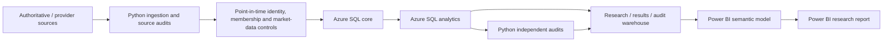

# S&P 500 Momentum & Performance Analytics

A reproducible empirical research project testing multiple momentum-related hypotheses on a **point-in-time S&P 500 universe** using Python, Azure SQL, statistical preregistration, independent quality gates, and Power BI.

The project was designed to answer a research question rather than to manufacture a profitable strategy. The final Version 1.0 evidence contains **eight frozen primary tests: zero supported, seven not supported, and one contradicted**.

## Project Status

**Research status:** concluded for Version 1.0  
**Reporting status:** complete  
**Canonical dashboard:** `dashboards/sp500_momentum_analysis_report.pbix`  
**Static research report:** `reports/publication/sp500_momentum_research_report_v1.0.pdf`

Final confirmatory conclusions:

| Research component | Question | Final decision |
|---|---|---|
| H1 — Canonical 12-1 momentum | Do higher 12-1 momentum S&P 500 stocks reliably outperform lower-momentum stocks and SPY? | **NOT SUPPORTED** |
| H2 — Sector-relative momentum | Does momentum remain reliable after ranking securities within point-in-time GICS sectors? | **NOT SUPPORTED** |
| H3A — Attention → sector-relative return | Does higher issuer news attention predict stronger next-month sector-relative return? | **NOT SUPPORTED** |
| H3B — Attention → Winner entry | Does higher issuer attention predict entry into the next-month momentum Winner decile? | **NOT SUPPORTED** |
| H3C — Attention × current Winner | Does attention have an incremental positive effect for current momentum Winners? | **NOT SUPPORTED** |
| H4A — Liquidity-sweep reversal | Do mechanically defined liquidity-sweep/rejection events predict 30-minute reversal in the preregistered direction? | **CONTRADICTED** |

The conclusion is not that momentum, attention, or liquidity-sweep effects can never exist. It is that the **specific preregistered implementations tested here did not produce confirmatory support in the validated sample**.

---

## Research Program

### H1 — Canonical 12-1 Momentum

H1 tests monthly S&P 500 momentum portfolios using the canonical 12-1 signal:

```text
price(t-1) / price(t-12) - 1
```

Key design choices:

- point-in-time S&P 500 membership;
- permanent security identity across ticker changes;
- validated pre-membership price history used only for feature support;
- 2021-01 through 2025-12 ranking window;
- 60 ranking months;
- 59 completed one-month forward-performance months;
- equal-weight momentum deciles;
- D01 = lowest momentum;
- D10 = highest momentum;
- December 2025 retained as a valid ranking month but right-censored for January 2026 performance.

Final H1 findings include:

- D10 annualized return: approximately **13.23%**
- D01 annualized return: approximately **10.54%**
- SPY annualized return: approximately **14.83%**
- WML cumulative return: approximately **-1.63%**
- WML HAC p-value: approximately **0.8351**
- D10 excess-SPY HAC p-value: approximately **0.8223**
- cross-decile slope HAC p-value: approximately **0.8515**

The decile-return pattern was not monotonic, D10 did not reliably outperform SPY, and the primary H1 family was not statistically significant.

### H2 — Sector-Relative Momentum

H2 tests whether canonical momentum becomes stronger after ranking securities **within their point-in-time GICS sector** and combining the sector sleeves with equal sector weights.

Final aggregate sector-neutral Winner-minus-Loser findings:

- completed months: **59**
- mean monthly return: approximately **+0.186%**
- annualized arithmetic mean: approximately **+2.24%**
- annualized volatility: approximately **11.40%**
- maximum drawdown: approximately **-13.23%**
- primary HAC(3) p-value: approximately **0.6043**

The positive point estimate was not statistically distinguishable from zero. The preregistered implementation-cost and concentration rules also did not establish broad support.

### H3 — Issuer Attention and Momentum Outcomes

H3 introduces an external, point-in-time issuer-news attention predictor built from direct **GDELT GKG** historical archives.

The attention layer was frozen before it was allowed to touch H3 outcomes.

Primary predictor design:

1. build point-in-time company-name aliases;
2. map securities to issuer identity using SEC CIK where available;
3. deduplicate attention to issuer-day;
4. aggregate to issuer-month;
5. transform issuer attention using `ln(1 + 1,000,000 × attention_share)`;
6. standardize within month across eligible issuers;
7. map the frozen issuer-month value back to eligible security rows.

June 2025 was excluded from the primary attention predictor because GDELT source coverage fell below the frozen 90% month-eligibility threshold.

Frozen H3 samples:

- predictor rows: **29,287**
- H3A/H3C eligible rows: **29,114**
- H3B eligible rows: **26,139**
- issuer clusters: **583**

Primary results:

| Component | Estimate | Raw p-value | Holm-adjusted p-value | Decision |
|---|---:|---:|---:|---|
| H3A | -0.001959 | 0.3607 | 0.3607 | Not supported |
| H3B | +0.007130 | 0.0449 | 0.1346 | Not supported |
| H3C | -0.002878 | 0.1405 | 0.2809 | Not supported |

H3B produced the strongest nominal result, but it did **not** survive the frozen three-test Holm correction and therefore is not reported as confirmatory support.

### H4 — Intraday Liquidity Sweeps

H4 tests a mechanically defined intraday support/resistance liquidity-sweep and same-bar rejection hypothesis using audited **Alpaca SIP one-minute data**.

Primary H4A design:

- event-level signed 30-minute return;
- positive sign = movement in the preregistered rejection direction;
- intercept-only OLS;
- session-cluster-robust covariance;
- two-sided alpha = 0.05.

Final H4A result:

- eligible events: **164**
- eligible sessions: **156**
- mean signed 30-minute return: approximately **-0.061314%**
- two-sided p-value: approximately **0.03538**
- decision: **CONTRADICTED**

The average post-event movement was statistically significant in the **opposite** direction from the preregistered reversal prediction.

---

## Why the Project Uses Point-in-Time Data

A current S&P 500 constituent list cannot be applied backward to historical dates without creating survivorship bias.

This project therefore reconstructs membership through time from:

- a verified State Street SPY holdings anchor;
- official S&P Dow Jones Indices membership-change evidence;
- documented security/ticker aliases;
- security-level membership intervals;
- independent-security market inception and termination controls.

Historical ranking eligibility and historical feature support are deliberately separate concepts.

A security may contribute pre-membership price history to a trailing momentum feature **without being treated as an S&P 500 member before its actual membership date**.

---

## Data Sources

The project emphasizes authoritative or primary sources.

Major sources include:

- **State Street SPDR S&P 500 ETF Trust (SPY)** — current constituent anchor;
- **S&P Dow Jones Indices / S&P Global** — historical S&P 500 membership actions and GICS transition evidence;
- **SEC Form N-PORT / SEC issuer identity data** — historical sector-state and company-name evidence;
- **Yahoo Finance** — primary historical daily market-price source;
- **Tiingo** — validated fallback and historical identity/boundary source;
- **Investing.com archived historical export** — validated fallback for historical IHS Markit (`INFO`);
- **FRED DGS1MO** — ex-ante one-month Treasury constant-maturity yield proxy;
- **GDELT GKG** — historical issuer news-attention source;
- **Alpaca SIP** — intraday H4 one-minute market data.

Wikipedia is not used as a project data source.

Raw provider datasets are intentionally not redistributed when licensing, reproducibility, or repository-size considerations make code + provenance the better version-control choice.

---

## Architecture



### Responsibility by Layer

**Python**

- acquisition;
- source normalization;
- deterministic identity resolution;
- independent integrity audits;
- preregistration tooling;
- confirmatory statistical execution where required;
- checksum / provenance controls.

**Azure SQL**

- normalized market-data storage;
- point-in-time analytical transformations;
- momentum rankings;
- forward returns;
- portfolio-performance layers;
- H1-H4 educational research warehouse;
- final frozen reporting contract.

**Power BI**

- presentation;
- descriptive interaction;
- research-result communication.

Power BI does **not** redefine confirmatory inference.

Official coefficient estimates, p-values, multiple-testing adjustments, and hypothesis decisions remain anchored to the validated SQL research layer.

---

## Research Integrity

Several design principles are enforced throughout the repository.

### Preregistration Before Confirmatory Testing

H2, H3, and H4 include explicit preregistration / pre-outcome gates.

The project records:

- model definitions;
- sample rules;
- expected coefficient directions;
- covariance estimators;
- multiple-testing families;
- cost assumptions;
- robustness rules;
- decision labels

before the corresponding confirmatory result is accepted.

### Outcome Firewalls

For H3 and H4, source construction and predictor/event preparation were separated from outcome inspection.

The project records explicit authorization gates before outcome joins and confirmatory inference.

### Fail-Closed Missingness

Missing source coverage is not silently converted into zero attention or an available observation.

For example, June 2025 was excluded from primary H3 inference because source coverage failed the previously frozen rule.

### Negative Results Are Preserved

The project does not retune completed hypotheses after an unfavorable result.

H1 and H2 remain closed as not supported.

H3B's nominal raw p-value below 0.05 remains not supported because it fails the preregistered Holm correction.

H4A remains contradicted because its statistically significant effect is opposite the preregistered direction.

---

## Power BI Report

Canonical file:

```text
dashboards/sp500_momentum_analysis_report.pbix
```

Final pages:

1. **Executive Research Summary**
2. **H1 — Canonical Momentum**
3. **H2 — Sector-Relative Momentum**
4. **H3 — Attention and Momentum**
5. **H4 — Intraday Liquidity Sweeps**
6. **Interpretation & Research Limits**

The synchronized Year slicer is allowed to filter descriptive/time-series visuals.

It is deliberately prevented from redefining:

- frozen p-values;
- official decisions;
- primary-result matrices;
- full-sample confirmatory cards.

Permanent report-layer DAX and presentation fields are documented in:

```text
docs/power_bi_dax_measures.md
```

A publication-ready static companion report is available at:

```text
reports/publication/sp500_momentum_research_report_v1.0.pdf
```

The editable source is retained as:

```text
reports/publication/sp500_momentum_research_report_v1.0.docx
```

---

## Repository Structure

```text
sp500-momentum-performance-analysis/
├── dashboards/
│   └── sp500_momentum_analysis_report.pbix
├── data/
│   ├── raw/                  # provider source data; generally not committed
│   ├── interim/              # reproducible generated datasets; generally ignored
│   └── reference/            # curated provenance / control / preregistration files
├── docs/
│   ├── project_log.md
│   ├── analytical_methodology.md
│   ├── power_bi_semantic_model.md
│   ├── power_bi_desktop_build.md
│   ├── power_bi_dax_measures.md
│   └── ... research protocols and preregistration documents
├── reports/
│   ├── analysis/
│   ├── confirmatory/
│   ├── data_quality/
│   ├── exploratory/
│   └── publication/
│       ├── sp500_momentum_research_report_v1.0.pdf
│       └── sp500_momentum_research_report_v1.0.docx
├── sql/
│   ├── schema/
│   └── analytics/
├── src/
│   ├── ingestion/
│   └── analysis/
├── .gitignore
├── requirements.txt
└── README.md
```

---

## Reproducibility

The detailed technical audit trail is:

```text
docs/project_log.md
```

That document records the chronological development history, data-source decisions, validation populations, quality-gate results, methodological corrections, output artifacts, and research decisions.

General reproduction sequence:

1. configure the Python environment from `requirements.txt`;
2. configure required environment variables / credentials locally;
3. run source acquisition and validation stages;
4. reconstruct point-in-time membership and security identity;
5. build validated market-data layers;
6. deploy / populate the Azure SQL schema;
7. apply analytical SQL migrations in sequence;
8. execute independent Python integrity audits;
9. reproduce frozen H1-H4 research outputs;
10. apply the Power BI semantic model;
11. open / refresh the canonical PBIX against the validated `bi` schema.

The repository intentionally separates reproducible code/reference controls from large or provider-restricted raw datasets.

Do not commit:

- `.env`;
- API keys;
- database credentials;
- provider credentials;
- raw datasets that are intentionally excluded;
- reproducible `data/interim/` outputs unless a specific artifact is deliberately versioned.

---

## Key Validated Data Checkpoints

Selected project anchors include:

- current constituent anchor: **503 securities** as of 2026-08-10;
- historical membership interval identities: **593**;
- standardized historical price requests: **596 / 596 passed**;
- standardized daily observations: **783,086**;
- point-in-time constituent bridge rows: **631,942**;
- SPY trading sessions in 2021-2025: **1,255**;
- corrected canonical momentum assignments: **30,121**;
- completed H1 forward-performance months: **59**;
- H2 completed aggregate W-L months: **59**;
- H3 predictor rows: **29,287**;
- H4 primary events: **164**.

These are control anchors, not a substitute for the full audit trail.

---

## Limitations

Version 1.0 should be interpreted within its frozen scope.

Important limitations include:

- a 2021-2025 primary ranking / outcome window;
- gross-return emphasis in the primary Power BI reporting layer;
- transaction-cost and borrow-cost values in research sensitivity layers are scenarios rather than reconstructed executions;
- DGS1MO is a constant-maturity yield proxy rather than a realized Treasury-bill investment;
- CAPM is a one-factor control;
- GDELT attention depends on source availability and conservative point-in-time issuer aliases;
- June 2025 is excluded from primary H3 predictor eligibility because of insufficient GDELT source coverage;
- H4 applies only to the explicitly coded liquidity-sweep / same-bar rejection definition and 30-minute primary horizon;
- unsupported hypotheses should not be interpreted as proof that an effect can never exist in another sample or specification.

---

## Version 1.0 Conclusion

The Version 1.0 research program is scientifically complete.

The project did **not** find confirmatory support for the tested canonical momentum, sector-relative momentum, or issuer-attention hypotheses.

The preregistered H4A liquidity-sweep reversal hypothesis was statistically contradicted.

That outcome is itself the research result.

Future work may extend the historical sample, introduce new factor controls, update post-2025 data, or open new hypotheses, but those should be treated as **new Version 2 research** rather than as revisions designed to obtain a favorable Version 1 conclusion.

---

## License

Original project code is released under the repository's MIT License.

Third-party data remain subject to their respective providers' terms and are not relicensed by this project.
